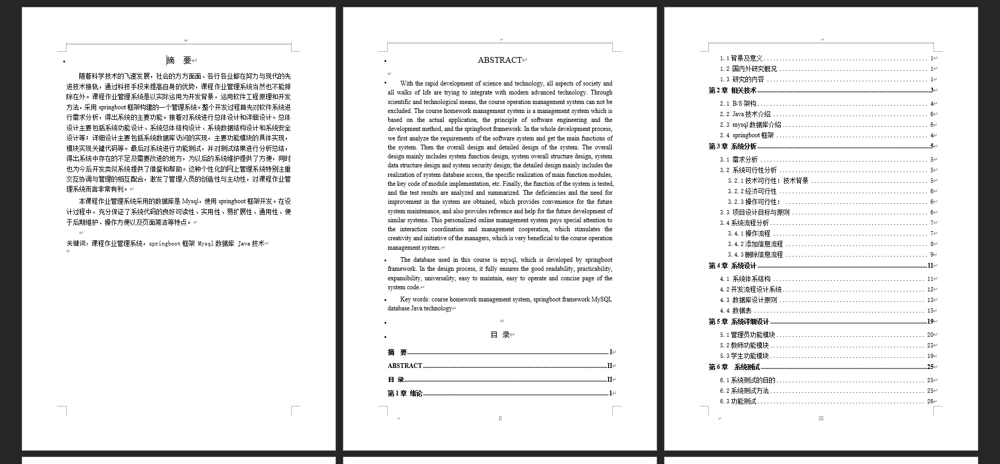
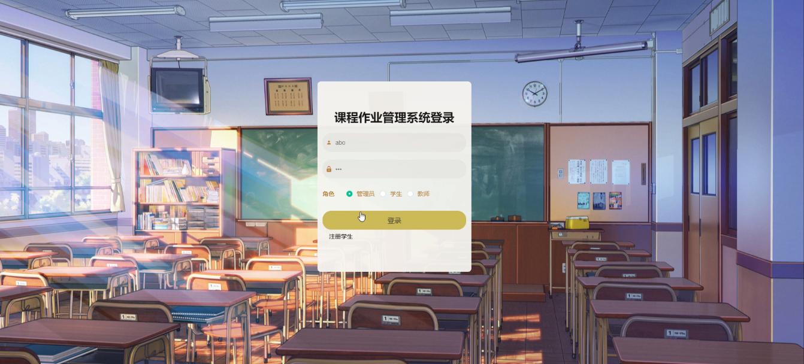
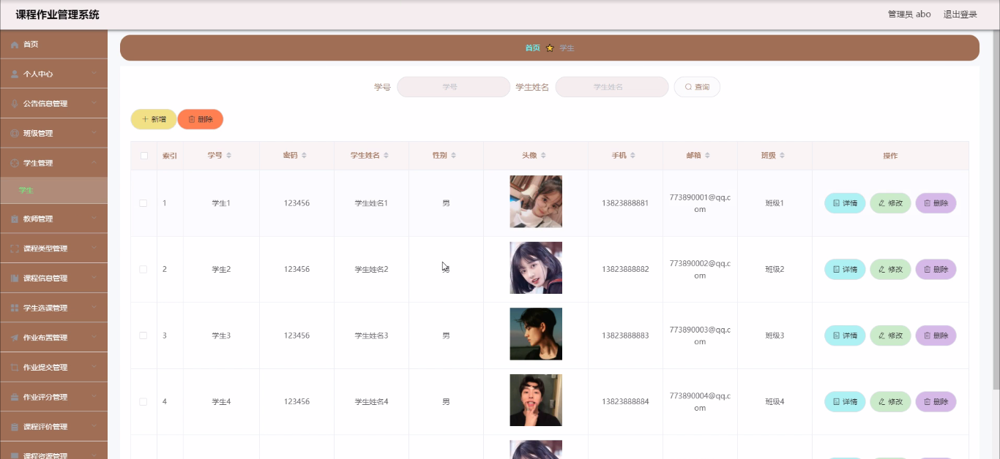
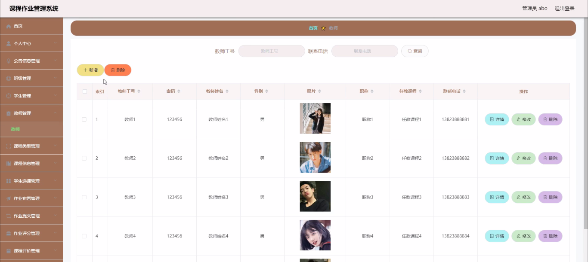
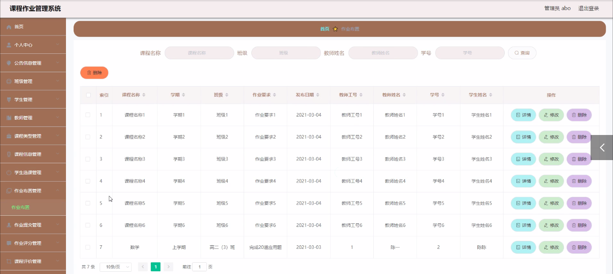
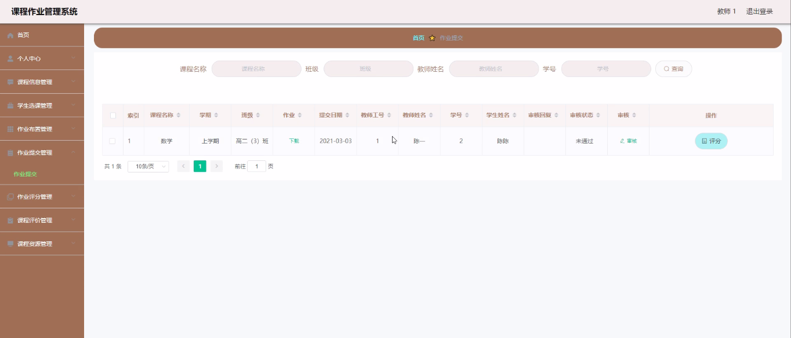
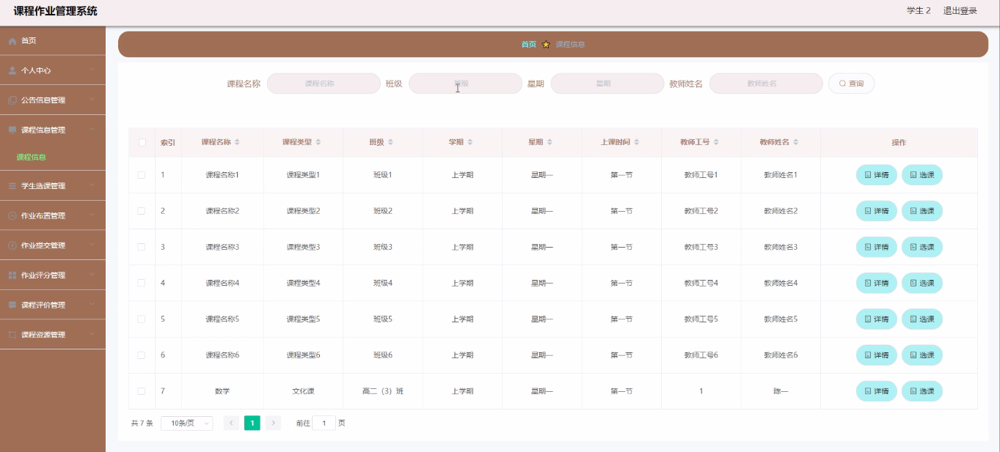

基于Springboot的课程作业管理系统（程序+论文）
=
### 完整代码获取地址：从戎源码网 ([https://armycodes.com/](https://armycodes.com/))
### 作者微信：19941326836  QQ：952045282 
### 承接计算机毕业设计、Java毕业设计、Python毕业设计、深度学习、机器学习
### 选题+开题报告+任务书+程序定制+安装调试+论文+答辩ppt 一条龙服务
### 所有选题地址https://github.com/nature924/allProject

一、项目介绍
---
系统包含两种角色：用户、管理员，系统分为前台和后台两大模块，主要功能如下：
### 管理员功能模块
登录: 管理员通过用户名、密码、角色进行登录。
首页查看: 查看个人中心、公告信息、班级管理、学生管理、教师管理、课程类型、课程信息、学生选课、作业布置、作业提交、作业评分、课程评价、课程资源等信息。
学生管理: 管理员管理学生信息，包括详情查看、修改、删除。
教师管理: 管理员管理教师信息，包括详情查看、修改、删除。
课程信息管理: 查看和管理课程信息，包括课程名称、类型、班级等。
作业布置管理: 查看和管理作业布置信息，包括课程名称、学期、班级等。
作业提交管理: 查看和管理作业提交信息，包括课程名称、学期、班级等。
课程评价管理: 查看和管理课程评价信息，包括课程名称、类型、评分等。

### 教师功能模块
登录: 教师通过用户名、密码、角色进行登录。
首页查看: 查看个人中心、课程信息管理、学生选课管理、作业布置管理、作业提交管理、作业评分管理、课程评价管理、课程资源管理等内容。
作业布置管理: 管理作业布置信息，包括修改作业要求等。
作业提交管理: 管理作业提交信息，包括修改或删除作业信息。
课程评价管理: 管理课程评价信息，包括查看、修改、删除评价内容。

### 学生功能模块
登录: 学生通过用户名、密码、角色进行登录。
首页查看: 查看个人中心、公告信息、课程信息管理、学生选课管理、作业布置管理、作业提交管理、作业评分管理、课程评价管理、课程资源管理等内容。
个人信息管理: 查看和管理个人信息，包括学号、密码、姓名、性别、手机、邮箱、班级等。
课程信息管理: 查看和管理课程信息，包括课程名称、类型、班级等。
课程评价管理: 管理课程评价信息，包括查看、删除评价内容。
课程资源管理: 查看和管理课程资源信息，包括上传和删除课程附件。

二、项目技术
---
- 编程语言：Java
- 数据库：MySQL
- 项目管理工具：Maven
- 前端技术：VUE、HTML、Jquery、Bootstrap
- 后端技术：Spring、SpringMVC、MyBatis

三、运行环境
---
- 操作系统：Windows、macOS都可以
- JDK版本：JDK1.8以上都可以
- 开发工具：IDEA、Ecplise、Myecplise都可以
- 数据库: MySQL5.7以上都可以
- Tomcat：任意版本都可以
- Maven：任意版本都可以

四、运行截图
---
### 论文截图：

### 程序截图：

